# Personalized Marathi and Mathematics Learning Portal

## 1. Current repository assessment

- The project starts from a clean Laravel 13 application using PHP 8.3+.
- No previous business logic, database design, authentication, UI, tests, deployment automation, or project documentation existed.
- Laravel Boost is installed for version-aware Laravel guidance.
- The default application uses SQLite for local bootstrapping. MySQL 8 remains the production database and will be available locally through Docker.
- The generated frontend starts with Vite and Tailwind. The product specification requires Bootstrap 5, so Phase 1 will replace Tailwind with Bootstrap rather than maintain two design systems.
- There was no matching remote repository. Work can continue locally, but a user-created GitHub repository is required before a pull request can be opened.

## 2. Recommended architecture

Use a modular Laravel monolith. The initial group is small, and a monolith minimizes operational complexity while preserving clear domain boundaries.

### Application layers

```text
Blade + Bootstrap + JavaScript/Canvas
                 |
          Laravel web routes
                 |
 Controllers -> Form Requests -> Policies
                 |
      Domain actions and services
                 |
        Eloquent models/events
                 |
             MySQL 8
```

### Domain modules

- Identity and tenancy: schools, roles, users, school membership, authorization.
- Academics: academic years, classes, divisions, subjects, skills, levels.
- Learning content: activities, questions, options, tests, games, simulations.
- Evidence: attempts, answers, sessions, results, and immutable skill events.
- Progress: per-student skill aggregates, recommendations, interventions.
- Motivation: XP transactions, streaks, badges, achievements, daily goals.
- Holistic development: observations, indicators, records, portfolios.
- Operations: notifications, audit logs, private files, reporting.

### Architectural decisions

1. **School-scoped tenancy:** school-owned records carry `school_id`; queries and policies enforce the school boundary.
2. **Role enum plus role table:** the table supports configurable metadata while a PHP enum prevents invalid application states.
3. **Event plus aggregate learning records:** `student_skill_events` is append-oriented evidence; `student_skill_progress` is a rebuildable read model.
4. **Academic-year snapshots:** enrollments and assignments reference an academic year so historical progress is retained.
5. **Server-authoritative results:** the browser may submit interaction evidence, but Laravel calculates accepted scores, XP, mastery, and badge awards.
6. **Private-by-default files:** portfolio, audio, and report files use private S3 objects and short-lived signed URLs.
7. **Queues for durable background work:** reports, media processing, and non-immediate notifications use queued jobs.
8. **No competitive leaderboard:** gamification compares a student with their own goals and progress.

## 3. Proposed database ER structure

```mermaid
erDiagram
    SCHOOLS ||--o{ USERS : contains
    ROLES ||--o{ USERS : grants
    SCHOOLS ||--o{ ACADEMIC_YEARS : runs
    SCHOOLS ||--o{ SCHOOL_CLASSES : organizes
    SCHOOL_CLASSES ||--o{ DIVISIONS : contains
    USERS ||--o| STUDENTS : has_profile
    USERS ||--o| MENTORS : has_profile
    STUDENTS ||--o{ STUDENT_ENROLLMENTS : enrolls
    ACADEMIC_YEARS ||--o{ STUDENT_ENROLLMENTS : scopes
    DIVISIONS ||--o{ STUDENT_ENROLLMENTS : places
    STUDENTS ||--o{ STUDENT_MENTOR_ASSIGNMENTS : receives
    MENTORS ||--o{ STUDENT_MENTOR_ASSIGNMENTS : provides
    ACADEMIC_YEARS ||--o{ STUDENT_MENTOR_ASSIGNMENTS : scopes

    SUBJECTS ||--o{ SKILLS : contains
    SKILLS ||--o{ SKILL_LEVELS : progresses
    SKILLS ||--o{ ACTIVITIES : teaches
    ACTIVITIES ||--o{ QUESTIONS : asks
    QUESTIONS ||--o{ QUESTION_OPTIONS : offers

    TESTS ||--o{ TEST_QUESTIONS : contains
    QUESTIONS ||--o{ TEST_QUESTIONS : included
    TESTS ||--o{ TEST_ATTEMPTS : attempted
    STUDENTS ||--o{ TEST_ATTEMPTS : takes
    TEST_ATTEMPTS ||--o{ TEST_ANSWERS : records

    GAMES ||--o{ GAME_LEVELS : contains
    GAMES ||--o{ GAME_SKILLS : maps
    SKILLS ||--o{ GAME_SKILLS : assessed
    STUDENTS ||--o{ GAME_SESSIONS : plays
    GAME_SESSIONS ||--|| GAME_RESULTS : produces

    SIMULATIONS ||--o{ SIMULATION_SKILLS : maps
    SKILLS ||--o{ SIMULATION_SKILLS : teaches
    STUDENTS ||--o{ SIMULATION_SESSIONS : uses

    STUDENTS ||--o{ PRACTICE_ATTEMPTS : completes
    PRACTICE_ACTIVITIES ||--o{ PRACTICE_ATTEMPTS : receives
    STUDENTS ||--o{ STUDENT_SKILL_PROGRESS : owns
    SKILLS ||--o{ STUDENT_SKILL_PROGRESS : summarizes
    STUDENTS ||--o{ STUDENT_SKILL_EVENTS : generates
    SKILLS ||--o{ STUDENT_SKILL_EVENTS : concerns

    STUDENTS ||--o{ XP_TRANSACTIONS : earns
    STUDENTS ||--|| STREAKS : maintains
    STUDENTS ||--o{ STUDENT_BADGES : earns
    BADGES ||--o{ STUDENT_BADGES : awarded
    STUDENTS ||--o{ DAILY_GOALS : receives

    MENTORS ||--o{ MENTOR_OBSERVATIONS : writes
    STUDENTS ||--o{ MENTOR_OBSERVATIONS : receives
    HOLISTIC_DOMAINS ||--o{ HOLISTIC_INDICATORS : contains
    STUDENTS ||--o{ HOLISTIC_RECORDS : receives
    STUDENTS ||--o{ INTERVENTIONS : receives
    INTERVENTIONS ||--o{ INTERVENTION_ACTIVITIES : includes
    STUDENTS ||--o{ PORTFOLIO_ITEMS : owns
```



### Integrity rules

- Unique student progress row per `(student_id, skill_id, academic_year_id)`.
- Unique active enrollment per `(student_id, academic_year_id)`.
- Unique role code, subject code, skill code within its subject, and badge code.
- Score and accuracy fields use bounded decimal values; counts remain non-negative.
- Attempts and learning events are retained when content is archived.
- Content records use soft deletion where historical evidence must continue resolving.
- School, academic year, status, and event timestamp indexes support reporting paths.

## 4. Implementation plan

| Phase | Outcome |
| --- | --- |
| 0 | Repository assessment and architectural decisions |
| 1 | Normalized schema, models, seed data, local environment, architecture documentation |
| 2 | Authentication, role middleware, policies, school/student isolation |
| 3 | School, class, division, student, mentor, and assignment management |
| 4 | Subject, skill, level, activity, question, and learning-path management |
| 5 | Practice engine and attempt evaluation |
| 6 | Pre-test, post-test, diagnosis, and improvement calculations |
| 7 | Marathi-first student dashboard and learning journey |
| 8 | XP, daily goals, streaks, badges, and achievements |
| 9-14 | Reusable game/simulation engines and initial Marathi/Mathematics experiences |
| 15-16 | Adaptive recommendations, interventions, and mentor analytics |
| 17-20 | Holistic progress, portfolio, reports, localization, and audio |
| 21-24 | Security hardening, comprehensive tests, AWS deployment, optimization |

Each phase requires migrations, backend behavior, authorized UI, tests, documentation, and a deployable state before the next phase.

## 5. Risk list

| Risk | Mitigation |
| --- | --- |
| Marathi learning content quality | Treat content as managed curriculum data and require educator review. |
| Client-side game score tampering | Issue server session tokens and validate result rules, timing, level, and replay protection server-side. |
| Cross-school or cross-student disclosure | School scopes, policies, opaque identifiers where appropriate, and explicit isolation tests. |
| Over-engineering for 15 students | Use a modular monolith and queues only for durable or expensive work. |
| Losing history across academic years | Academic-year-scoped enrollment, assignment, assessment, and progress records. |
| Incorrect mastery aggregation | Preserve immutable events, version calculation rules, and rebuild aggregates from evidence. |
| Accessibility gaps in games | Keyboard/touch controls, audio alternatives, reduced-motion support, and non-game equivalents. |
| Large project scope | Deliver vertical, tested phases rather than incomplete parallel features. |
| AWS operational cost/complexity | Start with one EC2 application instance, managed RDS, private S3, backups, monitoring, and documented restore steps. |

## 6. Dependency list

### Runtime

- PHP 8.3 or newer
- Laravel 13
- MySQL 8
- Node.js 22 or newer and npm
- Bootstrap 5, Bootstrap Icons, Chart.js
- Nginx and PHP-FPM in production

### Development and quality

- Composer 2
- PHPUnit 12
- Laravel Pint
- Docker Engine with Compose for local MySQL
- Git

Dependencies for PDF generation, image processing, browser testing, and AWS-specific integration will be introduced only in the phase that needs them.

## 7. Phase 1 task list

1. Establish the project repository, PHP/Laravel toolchain, and branching model.
2. Write architecture, ER model, local setup, security, testing, and deployment foundations.
3. Implement normalized migrations with foreign keys, uniqueness rules, indexes, and historical retention.
4. Implement Eloquent models, enums, relationships, casts, factories, and development seed data.
5. Add Docker Compose services for MySQL and local application development.
6. Replace the default frontend dependency with the specified Bootstrap 5 foundation.
7. Add migration, relationship, constraint, and seeder feature tests.
8. Run formatting, tests, production asset build, and application boot verification.
9. Publish Phase 1 as a focused pull request.
